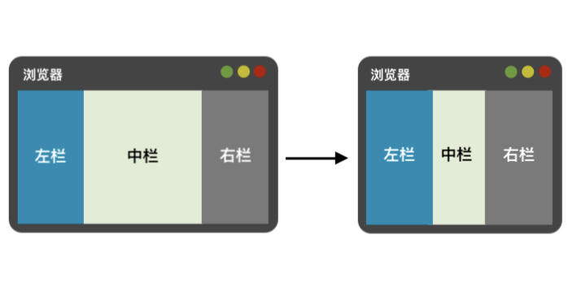
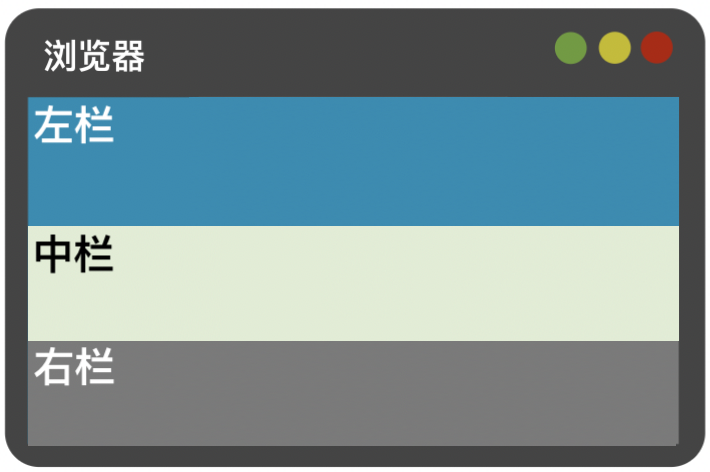
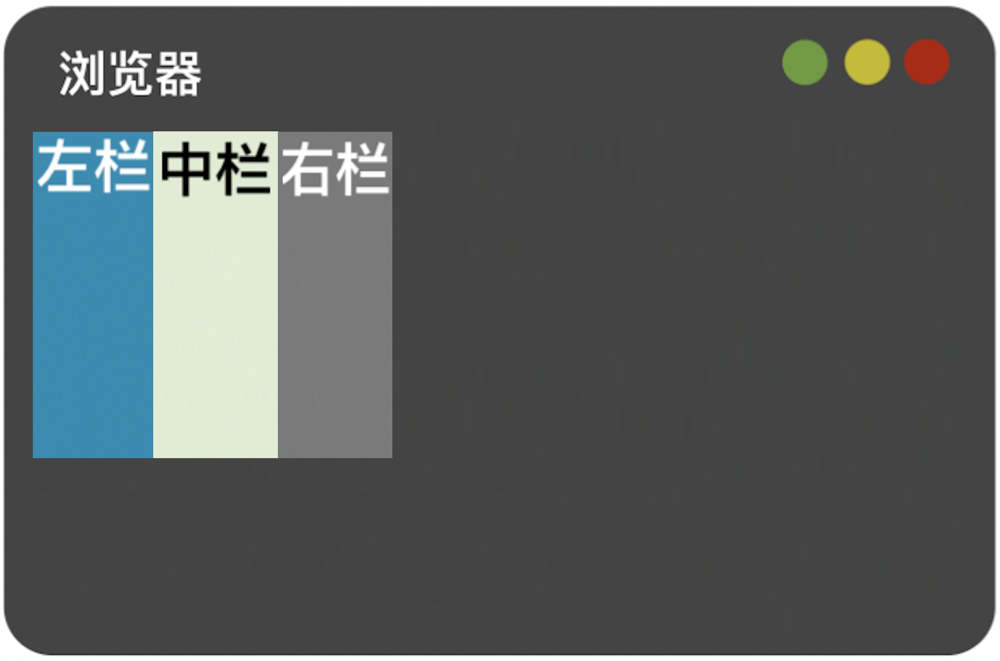
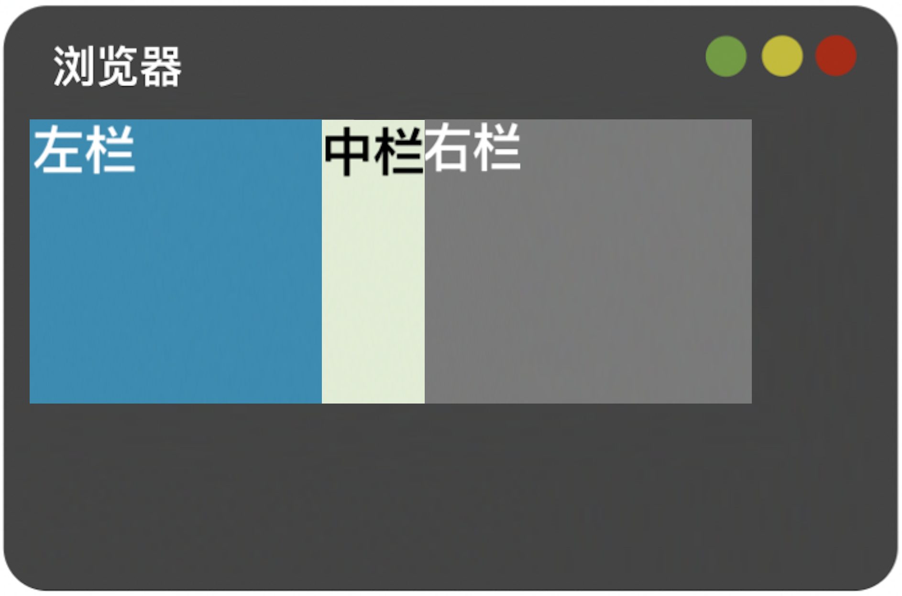
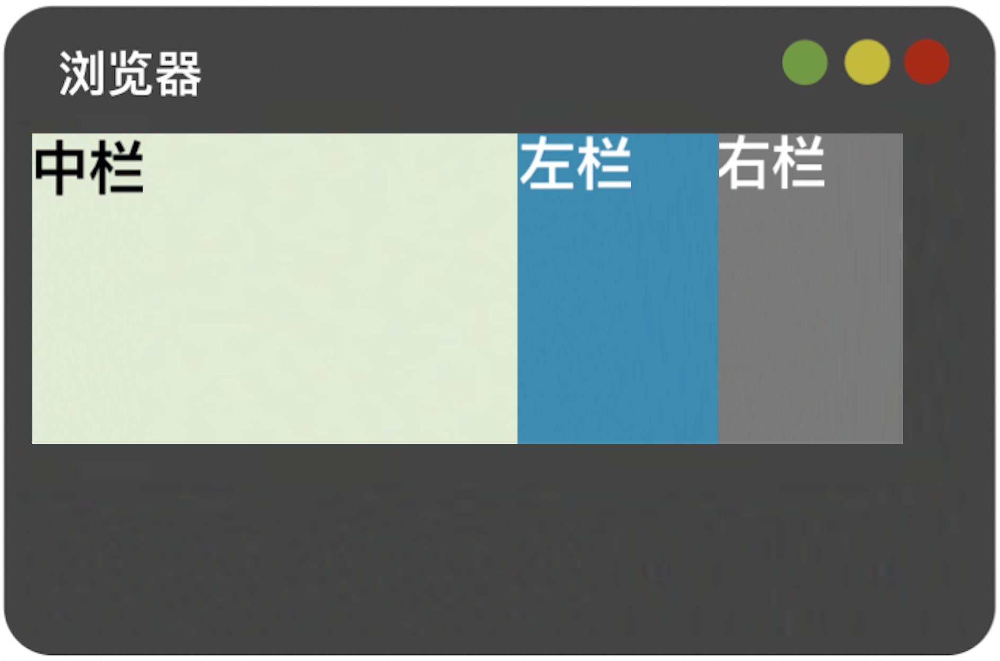
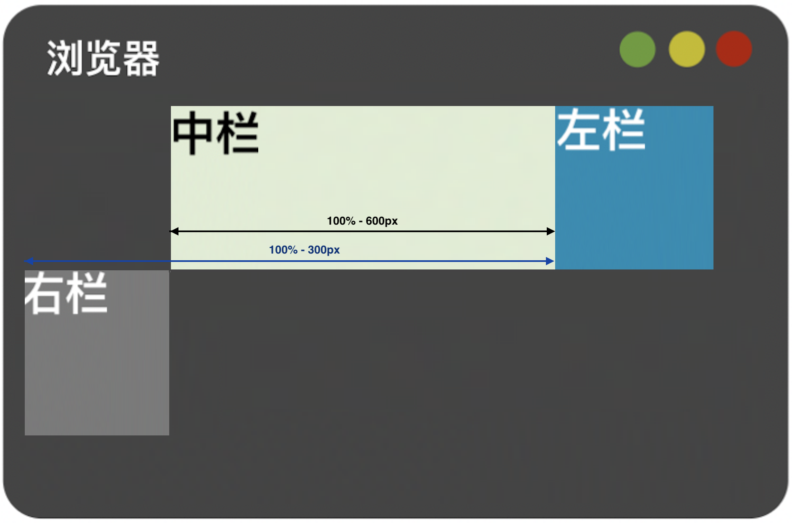
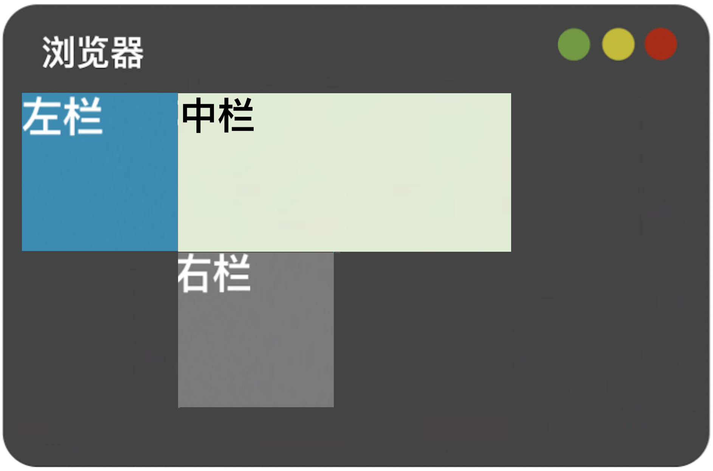

# CSS布局 - 三栏布局实现

三栏是CSS布局中常见的一种布局模式，顾名思义，就是将网页内容以三列的形式呈现。通常，三栏布局中的左栏和右栏是固定宽度的，中栏随着窗口宽度的变化而变化。本文探讨栏三栏的基本实现思路和经典方法，对其中涉及到的知识点进行梳理。




- [x] 目的：实现一个左栏和右栏宽300px，中间栏宽度自适应的三栏布局

### 基本实现思路

首先，常规思路，我们写出3个div的HTML和CSS，分别是leftColumn(左栏)、middleColumn(中栏)和rightColumn(右栏)。

HTML：
```html
<body>    
    <div id="leftDiv">左栏</div>
    <div id="middleDiv">中栏</div>
    <div id="rightDiv">右栏</div>
</body>
```

CSS：
```css
#leftDiv {
    height: 300px;  /*高度设为300像素，下同*/
    background-color: rgb(60,139,176);  /*设置背景颜色*/
}

#middleDiv {
    height: 300px;
    background-color: rgb(225,236,214);
}

#rightDiv {
    height: 300px;
    background-color: rgb(122,122,122);
}
```

此时，得到的网页如下图所示：



> 这是因为div的特性：默认宽度最大化(页面的100%)，默认高度最小化(根据内容自适应)。

上面的CSS中，只指定栏高度height:300px，未指定宽度，所以每个div都以宽度width:100%填满所在行。

注意：此时若尝试指定每个div的宽度，例如给每个div的CSS添加语句:

```
width: 100px;
```

得到的页面如下图左图，而非右图。


> 这是因为div属于块级(block)元素，默认情况下，块级元素总是会另起一行。

为了使块级元素能位于同一行，最简单的方法是使用float属性。我们对每个div的CSS新增语句：

```css
#leftDiv,#middleDiv,#rightDiv {
    float: left;  /*向左浮动*/
    height: 300px;  
}
```

使其向左浮动,得到的效果如下图所示：



可以看到，对CSS设置float:left属性后，三栏位于了同一行，宽度为其内容的适应宽度。此时，我们将左栏和右栏宽度设置为300px：

```css
#leftDiv,#rightDiv {
    width: 300px;  /*设置宽度为300像素*/
    ... 
}
#middleDiv {
    ...
}
```

得到的效果如下图所示：



此时，中栏的宽度仍为其内容的适应宽度，我们为middleDiv添加如下语句：
    ```
    width: calc(100% - 600px);  /*设置middleDiv宽度*/
    ```
> calc()的作用为动态计算长度值，允许各种单位混合运算，运算符前后需有空格。

于是我们得到了最终效果。左栏和右栏各300px宽，中栏根据浏览器窗口大小进行动态调整。但需要注意的是，当浏览器窗口宽度小于600px时，中栏的宽度将小于0。为此，我们可以为浏览其设置最小调整宽度，避免页面混乱：
```css
body {
    min-width: 700px;
}
```
至此，一个三栏布局就完成了。这种实现思路比较符合人的思维定势，但也存在一定的缺陷：**浏览器加载和渲染页面遵循从上到下的原则，这种方法中，HTML的middleDiv(中栏)位列于leftDiv(左栏)之后，所以会在leftDiv之后加载，而middleDiv往往是页面的核心，需要优先加载展示给用户。**

于是，我们思考将middleDiv放在HTML中的首位：
```html
<body>    
    <div id="middleDiv">中栏</div>
    <div id="leftDiv">左栏</div>
    <div id="rightDiv">右栏</div>
</body>
```
CSS中，我们仍然设置middleDiv(中栏)的宽度为100% - 600px：
```css
#middleDiv {
    width: calc(100% - 600px);
    ...
}
```
此时的界面如图所示：



可以看到，由于我们在HTML中将middleDiv(中栏)放在栏首位，所以浏览器窗口中，中栏显示在最前面。这时，我们需要为leftDiv(左栏)腾出空间，可以使用margin-left或padding-left。

> margin和padding分别为盒模型的外边距和内边距，此处使用两者皆可，此处唯一的区别是padding会被底色填充而margin不会。因为background-color的填充区域为content+padding+border。

>还有一点需要注意的是，padding值不能为负，对于需要取负值时，仅可使用margin。

为middleDiv(中栏)添加以下语句：
    ```
    margin-left: 300px;
    ```
此时效果如下图所示：



可以看到，由于增加了300px的外边距，第一行的横向空间被middleDiv(中栏)和leftDiv(左栏)填满，rightDiv(右栏)被迫位列第二行。

此时，我们使用relative属性对左栏和右栏进行处理：
```css
#leftDiv {
    position: relative;  /*相对定位*/
    left: calc(300px - 100%);  /*左移*/
    ...
}

#rightDiv {
    position: relative;
    top: -300px;  /*上移*/
    left: calc(100% - 300px);  /*右移*/
    ...
}
```
至此，我们在保证middleDiv(中栏)先行加载渲染的条件下，完成了三栏布局。基本思路为通过相对定位实现。


### 经典方法

CSS三栏布局的方法有很多种，其中最经典的方法莫过于圣杯布局和双飞翼布局。圣杯布局因形似圣杯而得名，即中栏为杯身，左右两栏为杯耳。双飞翼布局则是圣杯布局的一种改进，去掉了relative属性，并为主体部分增加了内容嵌套。


#### 圣杯布局([In Search of the Holy Grail](https://alistapart.com/article/holygrail))

圣杯布局和双飞翼布局都需要在HTML中为div增加一层“容器(container)”。这个容器的目的主要是为了利用padding对中栏进行调整。
    ```
    <body>  
        <div id="container">  
            <div id="middleDiv">中栏</div>
            <div id="leftDiv">左栏</div>
            <div id="rightDiv">右栏</div>
        </div>
    </body>
    ```
首先，仍然设置float:left属性使div浮动，使其位于一行。
```css
#leftDiv,#middleDiv,#rightDiv {
    float: left;
    ...
}
```
然后，将middleDiv(中栏)的宽度width设为100%：
```css
#middleDiv {
    width: 100%;
    ...
}
```
得到如下图所示的布局：


此时，需要将leftDiv置于第一行左侧:
    ```
    margin-left: -100%;  /* 左侧边界前移100% */
    ```
这样处理的结果是leftDiv(左栏)被置于第一行最左端，但会覆盖middleDiv(中栏)的部分内容。我们需要将中栏的内容从被覆盖的地方拉出来。一个简便的方法是对父容器container使用margin：
```css
#container {
    margin: 0 300px 0 300px;
}
```
> 此处使用padding:0 300px 0 300px; 效果相同。

此时，leftDiv(左栏)也会受父容器的影响向右移动300px，仍然覆盖着middleDiv(中栏)的一部分，所以我们使用相对定位让其向左移动：    
```css
#leftDiv {
    position: relative;
    left: -300px;
    ...
}
```
此时的布局如下图所示：

    
对rightDiv(右栏)作类似处理：
```css
#rightDiv {
    margin-left: -300px;  /*左侧边界前移300px*/
    position: relative;
    right: -300px;  /*右侧边界右移300px*/
    ...   
}
```
不要忘记为body设定最小宽度：
```css
body {
    min-width: 800px;
}
```
至此完成。

可以看到，圣杯布局的实现思想是给div套上一个父容器，通过调整父容器的padding和div左右栏的相对定位来实现三栏布局。


#### 双飞翼布局

双飞翼布局，源于淘宝UED，是圣杯布局的一种改进，或者说是另一种三栏实现思路。其创新点在于额外为middleDiv(中栏)增加一个子div存放其内容。
```html
<body>  
    <div id="container">
        <div id="middleDiv">
            <div id="content">中栏</div>
        </div>
        <div id="leftDiv">左栏</div>
        <div id="rightDiv">右栏</div>
    </div>
</body>
```
仍然使用float属性来对div进行浮动：
```css
#leftDiv,#middleDiv,#rightDiv {
    float: left;
    ...
}
```
与圣杯类似，设置middleDiv(中栏)宽度为100%，且将leftDiv(左栏)拉到最左侧，将rightDiv(右栏)作类似处理：
```css
#middleDiv {
    width: 100%;
    ...
}

#leftDiv {
    margin-left: -100%;
}

#rightDiv {
    margin-left: -300px;
}
```
到这一步为止，双飞翼布局方法和圣杯CSS方法并不不同。

此时，由于双飞翼布局方法为middleDiv(中栏)单独添加了一个div存放其内容，所以对于中栏的处理，可以使用该div的margin属性：
```css
#content {
    margin: 0 300px 0 300px;
}
```
> 此处使用padding:0 300px 0 300px; 效果相同。

同样，不要忘记为body设定最小宽度：
```css
body {
    min-width: 800px;
}
```
至此完成。

可见，圣杯布局方法与双飞翼布局方法的区别在于圣杯布局采用相对位置属性(position:relative)来调整左栏和右栏位置，并使用margin/padding属性调整中栏。而双飞翼布局方法无需相对位置属性，而是采用为中栏内容创建div的方式，通过margin/padding来实现布局。

### 总结

本文探讨了三栏布局的CSS基本实现方法，首先以基本思路对三栏布局进行实现，发现不足，进行调整。文章第二部分阐述了流行的圣杯布局方法和双飞翼布局方法的细节和异同。除本文所述布局方法外，还存在绝对定位法、table布局法、网格布局法等多种方法，各有利弊，可根据需求使用和改造。关于这些方法的讨论将在以后实际应用时进行总结。
