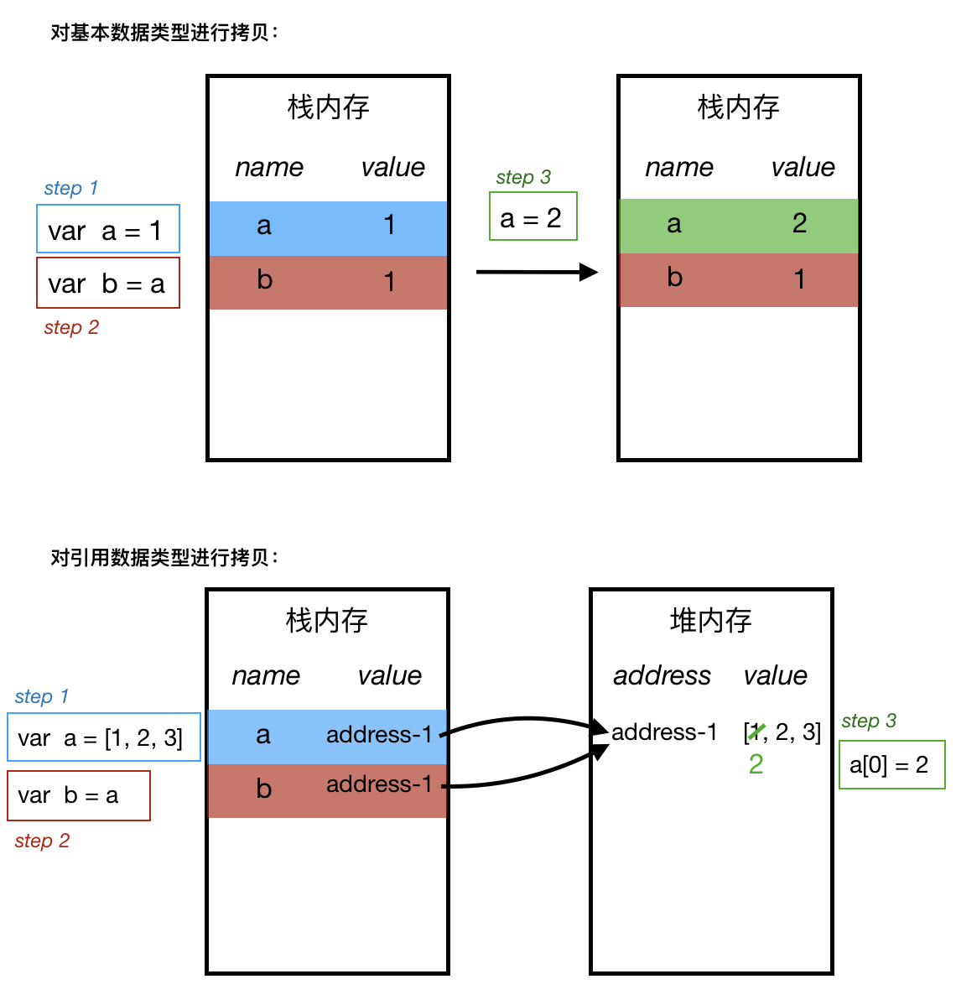

# 浅拷贝和深拷贝

### 什么是深拷贝和浅拷贝？


名称 | 定义
---|---
浅拷贝   | 对基本数据类型进行值传递，对引用数据类型进行引用传递般的拷贝
深拷贝 | 对基本数据类型进行值传递，对引用数据类型，创建一个新的对象，并复制其内容

也就是说，对于a，让b对a进行拷贝，之后当a发生变化，若b也跟着发生变化，就是浅拷贝；若a发生变化，b不变化，那就是深拷贝。


基本数据类型 | 引用数据类型
---|---
Number、String、Boolean、Null、Undefined等 | Object、Array、Function等

**基本数据类型**是按值访问的，对其的拷贝会直接复制其值保存在新变量中。例如Number类型：

```javascript
var a = 1;
b = a;
console.log(b); // 1
a = 2;
console.log(b);  //1 （a的变化不会影响b的值）
```

而“引用数据类型”是按引用访问的，对其直接进行拷贝只会操作引用地址，而不是值本身。例如Array类型：

```javascript
var a = [1, 2, 3];
b = a;
console.log(a);  // [1, 2, 3]
console.log(b);  // [1, 2, 3]
a[0] = 2;
console.log(a);  // [2, 2, 3]
console.log(b);  // [2, 2, 3]  （对数组a的改动也影响了数组b）
```
其原理如下图所示：




**那么，如何对引用数据类型实现深拷贝呢？**

> 显而易见的思路是：既然是因为引用地址造成了无法深拷贝，那就抛开引用地址，直接对值进行遍历，将其拷贝给新的变量。


#### 方法1: 手工遍历法

```javascript
let a = [1, [2, 3], 4];
const copy = (obj) => {
  let newObj = obj.constructor === Array ? [] : {}
  if(typeof obj !== 'object') {
    return;
  }
  for(let i in obj) {
    newObj[i] = typeof obj[i] === 'object' ? copy(obj[i]) : obj[i]
  }
  return newObj
}

let b = copy(a);  
a[1][0] = 3;
console.log(a);  // [1, [3, 3], 4]
console.log(b);  // [1, [2, 3], 4]
```

#### 方法2: JSON方法

```javascript
let a = [1, [2, 3], 4];

const copy = (obj) => {
  let _obj = JSON.stringify(obj)
  let newObj = JSON.parse(_obj)
  return newObj
}

let b = copy(a);  
a[1][0] = 3;
console.log(a);  // [1, [3, 3], 4]
console.log(b);  // [1, [2, 3], 4]
```

#### 方法3: JQuery-extend方法

```javascript
let a = [1, [2, 3], 4];

b = $.extend(true,[],a);

a[1][0] = 3;
console.log(a);  // [1, [3, 3], 4]
console.log(b);  // [1, [2, 3], 4]

```
